# Codex handoff — build the first working Tydly alpha

Last updated: 23 July 2026

## Mission

Take Tydly from a secure, compiled foundation to a **working ask-first Mac archivist that a
human can test with real files**.

The required vertical slice is:

1. Tydly watches only user-approved Desktop and Downloads folders.
2. Otto, the local agent, inspects stable regular files without uploading anything.
3. Otto groups real files by project and produces an evidence-backed proposal.
4. The user sees the exact immutable plan in the Finder demonstration.
5. Nothing moves until the user chooses **Looks Right**.
6. The move is journaled before mutation, same-volume, race-safe, and no-overwrite.
7. The receipt appears immediately and individual/batch undo survives restart.
8. Corrections become local agent memory.

Do not spend the next implementation cycle completing every later settings or subscription
screen. Finish this end-to-end path first.

## Product decision: Otto is the product

Tydly is not a file utility with an AI feature. It is an **agent-native, private local
archivist**.

- Otto must orchestrate every user-visible workflow.
- Local AI is required for novel project understanding and ambiguous decisions.
- Repeated, explicitly user-promoted rules may reuse deterministic learned knowledge without
  invoking the language model again, but still run through the Otto agent and safety policy.
- If Apple Intelligence or the local model is unavailable, Otto becomes watch-only. There is
  no cloud fallback and no new semantic proposal or move.
- The model is not the security boundary. `TydlyCore` owns consent, sensitivity, autonomy,
  execution authorization, and resting behavior.
- The model never receives filesystem write tools, bookmark data, or arbitrary paths.

Create `Documentation/PRODUCT_VISION.md` as the first documentation change and update
`Documentation/AI_ENGINE.md`, which currently describes model inference as optional. The
vision document should define:

- “Otto is the product.”
- What “magic” means: project understanding, local memory, evidence, demonstration,
  abstention, and learning.
- The agent loop: perceive → remember → reason → plan → demonstrate → act → learn.
- Model-unavailable behavior.
- The working-alpha scenario and product-quality metrics.

## Environment setup

This work requires a real Apple-silicon Mac.

Requirements:

- macOS 26 or later.
- Xcode 26 or matching Command Line Tools.
- Swift 6.2 or later.
- Apple Intelligence enabled for live Foundation Models testing.
- CLI workflow only; do not create an Xcode project or use the Xcode IDE.

Verify:

```sh
uname -s
uname -m
sw_vers
xcode-select -p
xcrun --sdk macosx --show-sdk-path
swift --version
```

If the environment is Linux, stop. Do not add platform stubs or weaken the package to make
SwiftUI/AppKit compile there.

## Git state

The current implementation is on:

```text
cursor/privacy-ai-engine-fb50
```

It belongs to draft PR #2 against `main`. At handoff time the PR is mergeable and all checks
are green.

Before starting:

```sh
git fetch origin cursor/privacy-ai-engine-fb50
git switch cursor/privacy-ai-engine-fb50
git pull --ff-only origin cursor/privacy-ai-engine-fb50
git status --short --branch
```

If PR #2 has already been merged, start a new feature branch from the updated `main` instead.
Do not work from the obsolete bootstrap default branch.

Preserve the configured Git identity and signing setup. Every commit must remain signed. Do
not rewrite existing history, force-push, merge a PR, or mark a PR ready unless the owner
explicitly asks.

## Read first

Read in this order:

1. `AGENTS.md`
2. `CLAUDE.md`
3. `README.md`
4. `Documentation/SECURITY.md`
5. `Documentation/AI_ENGINE.md`
6. `DesignHandoff/README.md`
7. `DesignHandoff/DESIGN.md`
8. Open `DesignHandoff/Archivaris Journey.dc.html` in a browser.

The Journey file remains the visual source of truth.

## Current verification baseline

The current branch is verified on arm64 macOS 26 with Apple Swift 6.3.2:

- `swift build` passes.
- 70 Core, AI, persistence, and capability tests pass.
- Abrupt-process ledger recovery probes pass.
- Signed debug and release privacy audits pass.
- The signed detached release app launches.
- SQLCipher is embedded and signed.
- The app has no network entitlement.

Run before changing code:

```sh
swift build
make test
make app
make audit
```

Also run `make run` on a logged-in Mac and complete the interactive checklist in `AGENTS.md`,
especially Powerbox selection and relaunch.

## What exists now

### `TydlyCore`

Pure deterministic contracts and policy:

- Ten product rules.
- Sensitive/unknown automatic-filing denial.
- Opaque execution capabilities.
- HMAC-bound authorization contracts.
- Immutable operation intents and recovery matrix.
- Immutable root-generation types.
- No SwiftUI, AppKit, Combine, or user-facing English.

### `TydlyAI`

The safe local model adapter:

- Apple `SystemLanguageModel`.
- Fresh local sessions.
- Greedy guided output.
- Candidate and evidence allowlists.
- No filesystem, networking, write tools, or arbitrary path generation.
- Can raise sensitivity but never clear it.

It is not yet a full agent. It currently acts mainly as a constrained reranker.

### `TydlyPersistence`

The encrypted trust substrate:

- SQLCipher 4.17.0 via Zetetic’s managed GRDB 7.11.1 fork.
- Dependencies pinned in `Package.resolved`.
- Device-local Keychain key.
- Ordered batches, operation events, exact inverse undo links, and repair states.
- `prepared → applied → committed` transitions.
- Canonical batch digest plus HKDF-separated HMAC receipt.
- Full integrity checks, migrations, encrypted backup, quarantine, and crash recovery.
- Any unresolved repair blocks new mutation intent.

It deliberately owns no filesystem mover API.

### `TydlyMacEngine`

The filesystem capability boundary:

- Desktop and Downloads selected through atomic `NSOpenPanel` Powerbox flow.
- Encrypted app-scoped bookmark generations.
- No absolute-path fallback.
- Rejects broad, overlapping, symlink, package, remote, read-only, ubiquitous, volume-root,
  and File Provider-backed selections.
- Complete policy and immutable identity revalidation on every use.
- Closure-scoped balanced access.
- Ledger-wide root-set revision CAS and crash-releasing file lock.
- New plans require active exact generations.
- Historical generations require a referencing nonterminal operation and DB reservation.

It does not yet watch, inventory, extract, classify, or move files.

### `Tydly`

The app UI:

- Menu-bar icon and popover states.
- Three-step onboarding with real Desktop/Downloads authorization.
- Debug state switcher.
- Still seeds decisions and logs from `SampleData`.

## Architecture to build

```mermaid
flowchart LR
    fsEvents["FSEvents dirty hint"] --> inventory["Scoped inventory coordinator"]
    inventory --> extractor["Read-only XPC extractor"]
    extractor --> evidence["Versioned evidence bundles"]
    evidence --> sensitivity["Deterministic sensitivity gate"]
    evidence --> memory["Local project memory"]
    memory --> agent["TydlyAgent orchestrator"]
    sensitivity --> agent
    agent --> localModel["TydlyAI on-device model"]
    localModel --> agent
    agent --> policy["TydlyCore policy"]
    policy --> plan["Immutable move plan"]
    plan --> demo["Finder demonstration"]
    demo --> approval["Opaque explicit approval"]
    approval --> ledger["SQLCipher prepared operation"]
    ledger --> mover["Race-safe same-volume mover"]
    mover --> receipt["Receipt and persistent undo"]
    receipt --> memory
```



Add a `TydlyAgent` target rather than expanding `AppModel` into the agent. Suggested
dependency direction:

```text
Tydly UI -> TydlyAgent
TydlyAgent -> TydlyCore, TydlyAI, persistence protocols
TydlyMacEngine -> scoped macOS I/O
TydlyAI -> TydlyCore only
TydlyPersistence -> TydlyCore
```

The agent orchestrates read-only evidence and memory. It does not directly move files.

## Implementation order

### 1. Product vision and agent contract

Create:

```text
Documentation/PRODUCT_VISION.md
Sources/TydlyAgent/
Tests/TydlyAgentTests/
```

Define:

- `TydlyAgent` actor/coordinator.
- `AgentMemory` and project-memory protocols.
- `AgentPlan` and typed evidence references.
- Model availability state.
- Observe-only behavior when the model is unavailable.
- One active sweep at a time, cancellation, thermal, and Low Power Mode behavior.

Create a Linear issue for this missing orchestration slice.

### 2. AH-76 — isolated read-only extraction

Build a separately signed, sandboxed XPC/helper target:

- No network entitlement.
- No Desktop/Downloads bookmark.
- No arbitrary write access.
- Main app passes already-open read-only `FileHandle` values and bounded metadata.
- Add byte, page, pixel, archive, memory, and timeout limits.
- Use native extraction first:
  - filesystem metadata and `UTType`;
  - PDFKit bounded text/page inspection;
  - ImageIO metadata;
  - Vision OCR where needed.
- Reject or mark unknown:
  - encrypted/malformed/excessive files;
  - packages, aliases, symlinks, apps, scripts, installers, archives, and special files.
- Return a typed `EvidenceBundle` with extractor revision and coverage.
- Never persist raw extracted text, rendered pages, or thumbnails.

The XPC bundle must be assembled and signed from SwiftPM by the CLI build script. Audit every
embedded executable for sandbox and no-network entitlements.

### 3. Scoped inventory and FSEvents

Create a dedicated Linear issue for this missing subsystem.

Implement:

- Initial enumeration of Desktop and Downloads inside
  `RootCapabilityStore.withResolvedRoot`.
- FSEvents only as “root became dirty”; callback paths never become operations.
- Debounced full reconciliation after dropped/coalesced/root-change events.
- File stability window before extraction.
- Opaque file IDs and root-generation-relative paths.
- Ignore partial downloads, hidden lock files, packages, links, mount points, placeholders,
  and executables.
- Cancellation when the user pauses or a capability needs reauthorization.

No moves in this stage.

### 4. AH-72 — sensitivity gate

Implement the three-state lattice:

```text
sensitive
unknown
clearedForCurrentFingerprint
```

Combine deterministic signals with OR semantics:

- IDs, payment/account patterns, financial and tax terms.
- Medical and insurance vocabulary/layout.
- OCR evidence.
- User tags and prior explicit sensitivity labels.
- Extraction coverage and failure state.

The local model may raise concern but can never clear deterministic sensitivity. Partial,
unsupported, encrypted, or low-quality extraction remains unknown.

### 5. Agent memory and AH-82 ranking

Persist only encrypted, data-minimized memory:

- Known projects and user-approved destination generation IDs.
- Corrected and accepted examples.
- Project aliases and bounded diverse prototypes.
- Typed evidence contributions.
- Must-link/cannot-link corrections.
- Prediction/model/extractor revision and eventual outcome.

Do not persist source text or free-form model transcripts.

Build deterministic candidate retrieval before model reasoning:

1. Explicit rules and corrections.
2. Project tokens and basename families.
3. Accepted examples.
4. Source application and work-session timing.
5. Local semantic similarity.

The local agent then reasons over a small allowlist. It may propose a new project label, but
never a destination path.

If a new project has no authorized destination, ask the user to choose its folder through
`NSOpenPanel`, persist that destination generation, rebuild the plan digest, and only then
demonstrate it.

### 6. Replace `SampleData` with real read-only decisions

Wire:

```text
RootCapabilityStore
  -> inventory
  -> XPC extraction
  -> TydlyAgent
  -> AppModel snapshot
  -> existing DecisionView
```

Keep a debug fixture mode, but production state must no longer seed `SampleData`.

At this milestone a human should be able to:

- drop real files into Desktop/Downloads;
- see Otto enter Observing/Working;
- receive a real grouped decision with a real reason;
- skip/park it;
- make zero filesystem changes.

### 7. AH-77 — Finder demonstration

Implement the exact Phase 02 plan and demo:

- The displayed file identities, root generations, destination, group members, extraction
  revisions, sensitivity state, collision result, and policy version form one immutable
  digest.
- **Show me** opens the demonstration and never approves directly.
- Esc and **Not Quite** change neither journal nor filesystem.
- Any changed source, destination, capability, sensitivity, or collision invalidates the
  plan.
- **Looks Right** issues the opaque package-scoped user-approval capability for that digest.
- Respect Reduce Motion and VoiceOver.

Use the full Finder overlay if reliable. The documented plan-window/inline-diff fallback is
acceptable for the first working alpha; do not fake actual Finder state.

### 8. AH-74 — safe mover and persistent undo

Only after the demonstration and ledger integration are complete:

- Ordinary regular files only.
- Same-volume APFS move only.
- No directories, packages, executables, providers, symlinks, hard links, aliases, or
  cross-volume copy/delete.
- Resolve exact root generations inside closure-scoped capabilities.
- Revalidate source identity immediately before mutation.
- Use descriptor-relative, no-follow traversal.
- Use no-overwrite atomic rename.
- Persist `prepared` before touching the filesystem.
- Verify destination identity before `applied`.
- Mark `committed` before emitting a receipt.
- Undo is a new authenticated inverse operation.
- A collision or changed identity enters repair; never overwrite or guess.

Extend the existing subprocess crash probes around every new mover transition.

### 9. Working-alpha integration

Do not enable automatic filing yet. The first testable build is entirely ask-first.

Test scenario:

1. Start with a clean app container.
2. Authorize Desktop and Downloads.
3. Place a mixed project fixture in both folders.
4. Otto performs a real local scan and groups the files.
5. Map the proposed project to a user-selected local destination.
6. Open the Finder demonstration.
7. Approve one same-volume group.
8. Verify exact files moved and unrelated files did not.
9. Undo one file.
10. Undo the remaining batch.
11. Repeat, force quit after each ledger/mover boundary, relaunch, and recover.
12. Disable Apple Intelligence and verify watch-only behavior with no new decisions/moves.
13. Verify zero outbound socket capability in every bundled executable.

## Definition of done for the working alpha

- Real file events produce real decisions; `SampleData` is not the production source.
- Otto is always the workflow orchestrator.
- Novel understanding uses only the on-device model.
- Model unavailable means watch-only, never cloud fallback.
- Real Desktop and Downloads grants survive restart.
- Raw file content, OCR, prompts, and responses are absent from logs and persistence.
- Sensitive/unknown files never auto-file.
- Every move requires the displayed digest or a future explicitly promoted rule.
- Every move has a receipt and individual/batch undo.
- Undo and crash recovery survive process restart.
- No overwrite and no cross-volume mutation.
- `swift build`, `make test`, `make app`, and `make audit` pass.
- Signed debug/release bundles and every helper pass entitlement inspection.
- The full manual scenario above is recorded with screenshots or a short screen capture.

## Work that is intentionally after the alpha

Do not block the working vertical slice on:

- Whisper bar.
- Weekly note.
- Subscription/trial UI.
- Full settings window.
- Automatic rule promotion.
- Cross-volume moves.
- Directory/package/archive filing.
- Advanced multilingual embeddings.

After the ask-first alpha works:

1. AH-80 — calibration and local feedback learning.
2. AH-79 — explicitly offered autonomy.
3. AH-78 — privacy controls, erase/export, and local diagnostics.
4. Error/repair UI, whisper bar, rules pane, weekly note, and subscription surfaces.

## Ten rules and hard constraints

Never weaken these:

1. Nothing moves without consent until a rule is explicitly promoted.
2. Sensitive files are permanently ask-first.
3. Every action is individually and batch undoable across restarts.
4. Autonomy is offered, never taken; two weekly mistakes self-demote.
5. Red means broken only; amber means waiting.
6. Whisper bar never asks questions.
7. No notification frameworks.
8. Idle menu-bar icon never animates.
9. Resting/decline deletes nothing.
10. Skipped decisions park, re-ask once Friday, then silence.

Additional constraints:

- Never add `com.apple.security.network.client`.
- No outbound networking, telemetry, crash uploader, model hub, local HTTP server, Private
  Cloud Compute, or cloud model.
- No Xcode project.
- No Full Disk Access, Accessibility, Apple Events, privileged helper, JIT, plug-in host, or
  dynamic model code.
- No model filesystem write tools.
- English copy only in `Localization.swift` and resources.
- Rule and safety logic only in `TydlyCore`.
- Use design tokens and components; no emoji UI.

## Linear tracking

Use the existing **Tydly** project under the **AgentHuddle** team for
`vanbodegraven.joel@gmail.com`.

Do not use Gymly.

Existing sequence:

- AH-75 — local AI contracts and privacy audit — In Review.
- AH-81 — encrypted operation ledger and crash reconciliation — In Review.
- AH-73 — security-scoped root capability store — In Review.
- AH-76 — read-only XPC extraction — next.
- AH-72 — deterministic sensitivity gate.
- AH-82 — explainable project retrieval/grouping/ranking.
- AH-77 — Finder demonstration digest.
- AH-74 — race-safe mover and persistent undo.
- AH-80 — calibration and local feedback.
- AH-79 — explicitly promoted autonomy.
- AH-78 — local privacy controls and erase/export.

Create issues for:

- Product vision and agent contract.
- `TydlyAgent` orchestration and memory.
- Scoped inventory and FSEvents reconciliation.
- End-to-end working-alpha acceptance test.

Move issues through In Progress → In Review only when code and verification match their
acceptance criteria.

## Engineering workflow

- One logical signed commit per change.
- Keep CI green after every slice.
- Use current latest dependency versions and pin security-sensitive dependencies.
- Add pure tests in Core, disk-backed persistence tests, malformed-input XPC tests,
  capability tests, subprocess crash tests, and signed app/helper integration checks.
- Update this handoff, `AGENTS.md`, security/AI docs, and Linear as the architecture changes.
- Do not merge or alter PR readiness without explicit owner instruction.

## Required final handoff

Report:

- What portion of the real vertical slice now works.
- Exact supported/unsupported file types and filesystems.
- Agent/model availability behavior.
- Security boundaries and any remaining manual release gate.
- Build/test/audit results and test count.
- Manual Powerbox/Finder/move/undo test results.
- Screenshots or recording of the working path.
- Linear issues completed and the next single priority.
